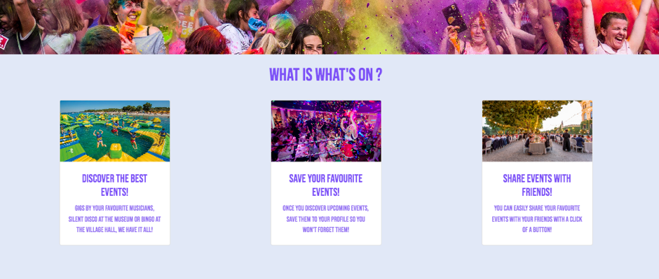

# What's On - Find the Best Events in Town! 

## Table of Contents

- [Deployed Link](#deployed-link)
- [Description](#description)
- [The What's On Experience](#the-whats-on-experience)
- [User Story](#user-story)
- [Tools](#tools)
- [Technologies](#technologies)
- [Screenshots](#screenshots)
- [Acceptance Criteria](#acceptance-criteria)
- [Conclusion](#conclusion)
- [Contact](#contact)

# Deployed Link

View the What's On app here:

# Description

Are you looking for the best events in town? With What's On, discover new places, artists, foods and more with your friends and family! Enter your current location and see the latest events with a click of a button!

# The What's On Experience

When a user lands on the homepage, they are presented with a search bar where they can add their location e.g. Orlando. When the search button is pressed, they are taken to a new page where a list of upcoming events are displayed.

A user can sign up and login. When a user is logged in, they can save their choice of events and send them to their friends.

Even if the user is not logged in, they can still search for events in their chosen location.

## User Story

```
AS A user looking for recreation activities in my free time
I WANT to view the latest events in my local area
SO THAT I can find new places and experiences to enjoy and share them with my friends
```

## Tools

Add Wireframes here

## Technologies

| This project implements a variety of frontend and backend technologies: |
| ----------------------------------------------------------------------- |
| HTML                                                                    |
| CSS                                                                     |
| Javascript                                                              |
| Handlebars                                                              |
| Express                                                                 |
| Axios                                                                   |
| Bootstrap                                                               |
| Web API (Google Events API)                                             |
| MySQL                                                                   |
| Sequelize                                                               |
| bcrypt                                                                  |
| Nodemon                                                                 |
| Node.JS                                                                 |
| dotenv                                                                  |
| Heroku                                                                  |

## Screenshots

Desktop viewport

<details>
<summary>Home Page</summary>




</details>

<br/>
Mobile viewport

<details>
<summary>Home Page</summary>

Home Page:


</details>
<br/>

## Acceptance Criteria

```
GIVEN I am a user looking for a recreational event
WHEN I visit the site
THEN I am presented with the homepage, nav bar (with the option to login / sign up) and a search bar
WHEN I type my location into the search bar
THEN I am presented with a list of events that will be occuring in the future
WHEN I sign up and login in
THEN I the list of events displays a 'save' button
WHEN I find an event I would like to attend
THEN I can save the event to My Events page
WHEN I navigate to the My Events page, I can send the event to a friend

```

# Conclusion

To conclude, this was a very fun and challenging project. We successfully load a variety of event cards for a given location. A preferred event can be saved. Bringing in the Web API, rather than just seeding the database ourselves, bought its own challenges which we faced successfully!

# Contact

If you have any questions, please contact the team:
[Abdilatif](https://github.com/awarsame1996/),
[Alex](https://github.com/talexandru1987),
[Gurmanpreet](https://github.com/Mkn01),
[Jinyi](https://github.com/jinyiyu) &
[Sophia](https://github.com/sophia4422)
